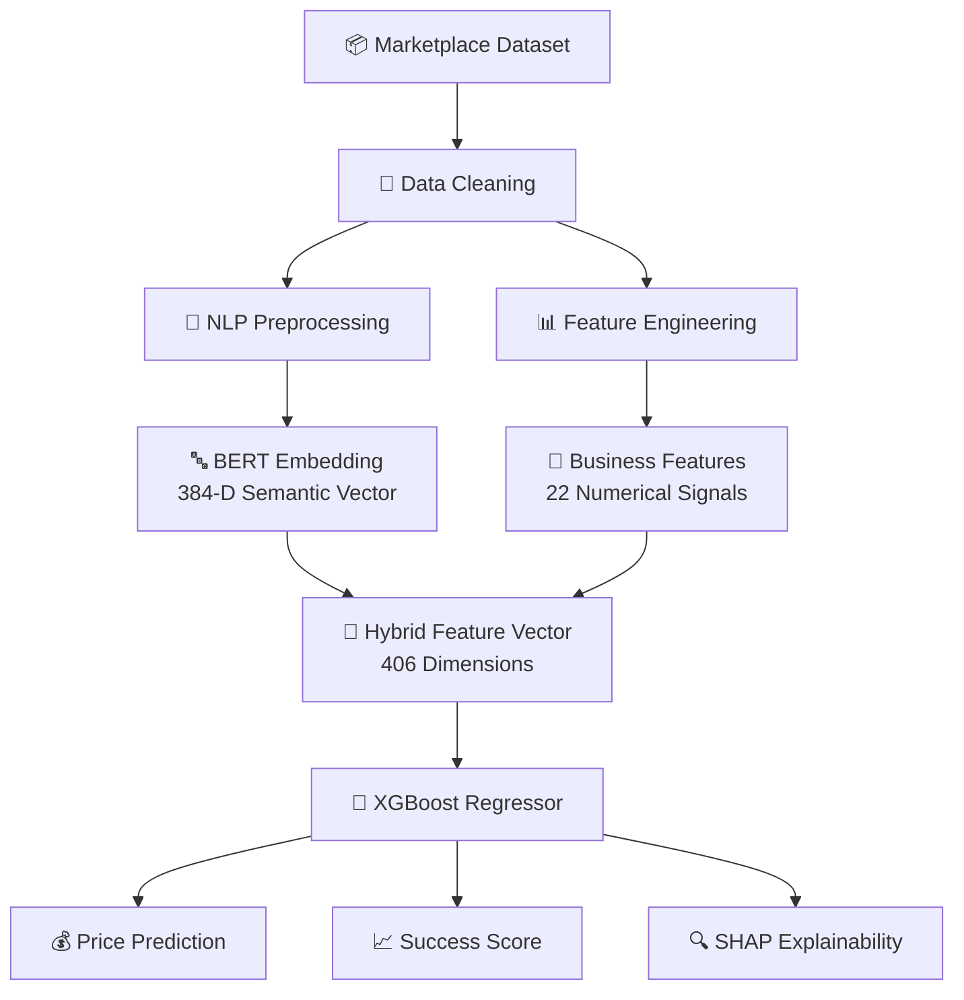

# 🌺 Wantilan Kriya v2

### AI Pricing Intelligence for Cultural Marketplace

> Hybrid NLP + Machine Learning system untuk memprediksi harga optimal produk UMKM dan cultural craft marketplace menggunakan Semantic AI.

---

## 📌 Overview

**Wantilan Kriya** adalah sistem AI berbasis **Hybrid NLP + Regression** yang dirancang untuk membantu seller marketplace menentukan harga produk secara lebih optimal.

Berbeda dengan pricing biasa yang hanya melihat biaya produksi, Wantilan Kriya menganalisis:

- 🧠 Semantic wording produk
- 🏺 Cultural branding
- ⭐ Seller trust & engagement
- 💎 Premium perception
- 🪵 Material awareness
- 📈 Marketplace behavior

Model mempelajari bagaimana pembeli memandang **perceived value** suatu produk berdasarkan teks dan metadata marketplace.

---

# 🚀 Live Demo

👉 HuggingFace Space:  
[Wantilan Kriya Demo](https://huggingface.co/spaces/barudakwell/wantilan-v2)

---

# 🧠 AI Architecture

